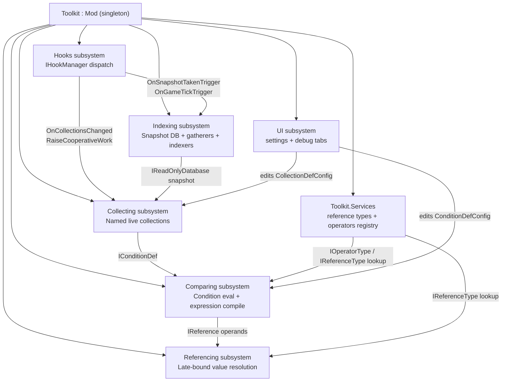
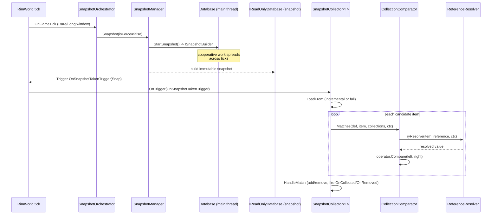

# Architecture Overview

`HomebrewDot.Net.RimWorld.Toolkit` is a single C# (.NET Framework 4.7.2) mod library for RimWorld 1.6 that exposes static APIs through a [`Toolkit : Mod`](../facades/toolkit.md) facade. It provides six cooperating subsystems: typed game-event **hooks**, snapshot-based background-queryable **indexing** of game data, declarative condition **comparing** with expression-tree compilation, named live **collecting** of objects that match conditions, late-bound **referencing** resolution, and an in-game debug **UI**.

## Composition Root

The composition root is `Toolkit` ([`src/.../Toolkit.cs`](../facades/toolkit.md)), a `Verse.Mod` subclass instantiated by RimWorld for the `homebrewdot.net.rimworld.toolkit` mod (see `About/About.xml`). The constructor:

1. Sets the singleton `Instance = this`.
2. Creates `ToolkitSettingsUi` for the mod settings window.
3. Calls `ConfigureServices()`, which registers all reference types, UI input helpers, and operator types into [`Toolkit.Services`](../facades/toolkit.md).

Static constructors across subsystems wire themselves into the [`Toolkit.Hooks.Manager`](../hooks/overview.md) event bus:
- `Toolkit.Indexing` static ctor registers an `OnSaveLoadedTrigger` hook (priority `byte.MaxValue`, lowest) that calls `StartIndexing(e.Game, true)`, and a `ToolkitSettings.Changed` hook that re-runs `StartIndexing(Current.Game)`.
- `Toolkit.Collecting` static ctor registers an `OnSaveLoadedTrigger` hook that warms the collection cache.
- `Toolkit.Helpers.Logging` static ctor registers a `ToolkitSettings.Changed` listener that updates verbosity flags.
- `GameTriggers` (`[StaticConstructorOnStartup]` `GameComponent`) installs Harmony patches on `TickManager.DoSingleTick`, `Game.LoadGame`, and `MainMenuDrawer.MainMenuOnGUI` in its static constructor, then fires `OnGameTickTrigger`/`OnSaveLoadedTrigger`/`OnGameLoadedTrigger`.
- `MapTriggers` (`MapComponent`) fires `MapLifecycleTrigger` on map load/generate/remove.
- `CooperativeWorkManager` (`GameComponent`) registers itself as `IHook<RaiseCooperativeWork>` in `FinalizeInit`.

## Subsystem Map



| Subsystem | Primary facade | Purpose | Wiki page |
|-----------|---------------|---------|-----------|
| Hooks | `Toolkit.Hooks.Manager` | Typed event dispatch, cooperative work | [Hooks](../hooks/overview.md) |
| Indexing | `Toolkit.Indexing` | Snapshot DB, gatherers, indexers, change tracking | [Indexing overview](overview.md), [Database & snapshots](../indexing/database-and-snapshots.md), [Gatherers & indexers](../indexing/gatherers-and-indexers.md) |
| Comparing | `Toolkit.Comparator` (via Collecting) | Condition evaluation, operators, expression compile | [Comparing](../comparing/overview.md) |
| Collecting | `Toolkit.Collecting` | Named collections, snapshot/monitor collectors | [Collecting](../collecting/overview.md) |
| Referencing | `Services.Get<IReferenceResolver>()` | Value resolution by reference type name | [Referencing](../referencing/overview.md) |
| UI | `ToolkitSettingsUi` | Mod settings, debug collections/snapshot tabs | [UI](../ui/overview.md) |
| Generic/Helpers | `Toolkit.Helpers`, `Toolkit.Pool/Cache` | Pooling, caching, reflection, guards | [Generic](../generic/overview.md) |
| Constants | `ToolkitConstants` | Mod interop, metadata keys, reflection caches | [Constants](../facades/constants.md) |

## Cross-System Workflow: Snapshot-Driven Collection

The central runtime flow connects all four data subsystems. A mod defines a collection via `Toolkit.Collecting.Build`, which compiles conditions and (for snapshot-driven collections) registers a `SnapshotCollector<T>` as an `IHook<OnSnapshotTakenTrigger>`. Each RimWorld tick, the Indexing orchestrator builds a snapshot cooperatively; when finished it fires `OnSnapshotTakenTrigger`. The collector pulls items from the immutable `IReadOnlyDatabase`, resolves each item's property/metadata via references, evaluates the compiled condition, and maintains a deduplicated set.



## Threading Model

- **`IDatabase` / `Database`** is main-thread only. Mutations (`Upsert`/`Update`/`Delete`) and gatherer pushes happen on the RimWorld main thread.
- **`IReadOnlyDatabase` / `ReadOnlyDatabaseSnapshot`** is the immutable snapshot, safe to read from background threads. Snapshot building itself is cooperative (spread across ticks via [`RaiseCooperativeWork`](../hooks/overview.md)), not truly parallel — but the resulting snapshot is never mutated once published, so consumers can read it concurrently.
- **`Toolkit.Services`** and **`Toolkit.Pool<T>`** use non-thread-safe collections (`Dictionary`/`List`/`Queue`), reflecting the single-threaded main-thread assumption for mutations.
- **`Cache<TKey,TValue>`** and the `Traversing` getter caches use `ConcurrentDictionary`.

## Build, Dev, and Test Model

### Projects (solution `HomebrewDot.Net.RimWorld.Toolkit.sln`)

| Project | Path | Target | Role |
|---------|------|--------|------|
| `HomebrewDot.Net.Rimworld.Toolkit` | `src/HomebrewDot.Net.RimWorld.Toolkit/` | `net472` | Product assembly |
| `HomebrewDot.Net.RimWorld.Toolkit.Tests` | `tests/Unit/.../` | `net472` | xUnit unit tests |
| `HomebrewDot.Net.RimWorld.Toolkit.IntegrationTests` | `tests/Integration/.../` | `net472` | xUnit integration tests |
| `HomebrewDot.Net.RimWorld.Toolkit.Benchmarks` | `bench/.../` | `net472` | BenchmarkDotNet |

Package versions are centralized in `Directory.Packages.props` (BenchmarkDotNet 0.12.1, Microsoft.NET.Test.Sdk 16.11.0, Moq 4.20.72, xunit 2.4.2). `Directory.Build.props` suppresses NU1507.

### RimWorld / Harmony reference resolution

The product csproj resolves RimWorld and Harmony assemblies via overridable environment variables (defaults shown):

- `RIMWORLD_ROOT` → `C:\Program Files (x86)\Steam\steamapps\common\RimWorld`
- `RIMWORLD_MANAGED` → `$(RimworldRoot)\RimWorldWin64_Data\Managed` (contains `Assembly-CSharp.dll`, `UnityEngine.CoreModule.dll`, `UnityEngine.IMGUIModule.dll`)
- `RIMWORLD_HARMONY_ROOT` → `$(RimworldWorkshopRoot)\2009463077\$(HarmonyVersion)\Assemblies` (contains `0Harmony.dll`)

References are `Private=false` (do not copy into the mod output). `RIMWORLD_VERSION` defaults to `1.6` and `HARMONY_VERSION` to `1.5`.

### Output and dev mod-sync

- `OutputPath` is `..\..\$(RimworldVersion)\Assemblies`, i.e. the built `HomebrewDot.Net.Rimworld.Toolkit.dll` lands in `1.6/Assemblies/` at the repository root — the RimWorld mod layout expected by `About/About.xml` (`supportedVersions: 1.6`).
- The `SyncModContentToModsFolderForTesting` MSBuild target (runs `AfterTargets="Build"` when `RimworldModsRoot` exists) uses `rsync` to mirror `About/About.xml`, `1.6/`, and optional `Defs/Patches/Languages/Textures/Sounds` into `$(RimworldModsRoot)\$(ModTestingFolderName)` (default `Homebrewed Toolkit - DEV`). It skips network (UNC) paths and silently skips when `rsync` is not on PATH. `About/DevPublishedFileId.txt` is synced as `PublishedFileId.txt` for dev Workshop uploads.

### Test layout

- **Unit tests** (`tests/Unit/.../`) mirror the source namespace structure (`Collecting`, `Comparing`, `Hooks`, `Indexing`, `Referencing`, `Extensions`, `Helpers`, `Collections`, `UI`). They use xUnit `[Fact]`/`[Theory]` and Moq for interfaces. The unit test project outputs to `$(TEMP)` to avoid the .NET Framework mapped-drive (J:\) security restriction.
- **Integration tests** (`tests/Integration/.../`) are tagged `[Trait("Category","Integration")]` and use real RimWorld XML `ThingDef`s and the real `Toolkit` static state. The `IndexingIntegrationCollection` (`[CollectionDefinition("IndexingIntegration", DisableParallelization = true)]`) serializes tests that touch the shared `Toolkit.Indexing.ConfigureSchema`/`ConfigureOrchestrator`/`ConfigureManager` events.
- **Testing models** live in `src/.../Testing/Models/` (`Null`, `Tentity<T>`/`Tentity`) and are shared by unit tests for reflection/metadata exercises. See [Testing & Build](../testing-and-build/overview.md).

### Validation commands

```bash
# Build the product assembly (outputs 1.6/Assemblies/HomebrewDot.Net.Rimworld.Toolkit.dll)
dotnet build src/HomebrewDot.Net.RimWorld.Toolkit/HomebrewDot.Net.Rimworld.Toolkit.csproj -c Release

# Run all unit tests
dotnet test tests/Unit/HomebrewDot.Net.RimWorld.Toolkit/HomebrewDot.Net.RimWorld.Toolkit.Tests.csproj

# Run integration tests (requires RimWorld installed at RIMWORLD_ROOT)
dotnet test tests/Integration/HomebrewDot.Net.RimWorld.Toolkit/HomebrewDot.Net.RimWorld.Toolkit.IntegrationTests.csproj

# Run a focused test class/namespace by filter
dotnet test tests/Unit/.../Tests.csproj --filter "FullyQualifiedName~Indexing.Components.DatabaseTests"

# Run benchmarks
dotnet run -c Release --project bench/HomebrewDot.Net.RimWorld.Toolkit
```

## Scope Boundaries

- The repository is a **library mod** (no content/Defs/Patches/Textures of its own beyond `About.xml`); it exists to be referenced by other mods that consume the static APIs.
- The `Patches/` source directory is empty. Harmony patches are applied programmatically (not via XML patch files): `GameTriggers.Patches` patches tick/load/menu methods, and `HarmonyThingGatherer` patches `Thing` lifecycle methods. Both are documented under [Hooks](../hooks/overview.md) and [Indexing gatherers](../indexing/gatherers-and-indexers.md).
- Secrets/credentials are out of scope; `About/DevPublishedFileId.txt` contains only a Workshop file id placeholder.
