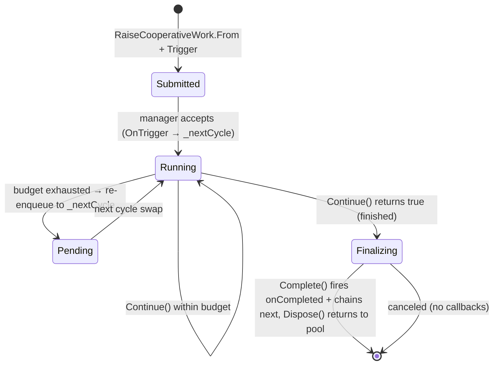

# Hooks Subsystem Overview

The Hooks subsystem (namespace `HomebrewDot.Net.Rimworld.Hooks`, components in `.Hooks.Components`, triggers in `.Hooks.Triggers`) is the typed event bus for the toolkit. It lets mods run code when RimWorld lifecycle events fire — game load, tick, map generation — without writing their own Harmony patches. Every other subsystem wires into the game through hooks: [Indexing](../indexing/overview.md) rebuilds on save load and ticks snapshots, [Collecting](../collecting/overview.md) warms its cache and reacts to collection changes, and the snapshot orchestration spreads work across ticks via cooperative work hooks.

The public surface is `Toolkit.Hooks.Manager` (an `IHookManager`), exposed as a nested static on the [`Toolkit`](../facades/toolkit.md) facade.

## Contracts

### `IHandler` (`Generic/IHandler.cs`)
The base ordering interface. A single `byte Priority { get; }` — handlers with higher priority execute before lower. `IHook<T>` extends `IHandler`; `CooperativeWorkManager` uses `byte.MinValue` (lowest) so it always runs after everything else.

### `IHook<T>` (`Hooks/IHook.cs`)
```csharp
public interface IHook<T> : IHandler where T : class
{
    object Owner { get; }   // grouping key for bulk unregister
    bool Once { get; }      // auto-unregister after first successful trigger
    bool OnTrigger(T arg); // returns true = handled; false = hook stays even if Once
}
```
The `Once` semantic is gated on the return value: a hook with `Once = true` is only unregistered when `OnTrigger` returns `true`. A returning `false` keeps the hook registered regardless of `Once`.

### `IHookManager` (`Hooks/IHookManager.cs`)
```csharp
void RegisterHook<T>(IHook<T> hook);
void UnregisterHook<T>(IHook<T> hook);
IHook<T>[] GetOwnerBy<T>(object owner);
IHook<T>[] UnregisterAllBy<T>(object owner);
bool Trigger<T>(T arg);          // synchronous, returns whether any hook replied
void TriggerDelayed<T>(T arg);   // defers to next tick via cooperative work
void TransferTo(IHookManager newManager);
```

The extension class `IHookManagerExtensions` adds the convenience overload most callers use:
```csharp
IHookManager RegisterHook<T>(this IHookManager, object owner, Action<T> action,
    bool once = false, Func<Exception, T, bool> errorHandler = null, byte priority = 128) where T : class
```
This wraps the action in a [`SimpleHook<T>`](#simplehookt) and registers it. The default priority is `128` (middle of the `byte` range). It returns the manager for chaining, as shown in the README advanced example:
```csharp
Toolkit.Hooks.Manager
    .RegisterHook<OnSaveLoadedTrigger>(Toolkit.Instance, e => Toolkit.Index.StartIndexing(e.Game, true))
    .RegisterHook<ToolkitSettings.Changed>(Toolkit.Instance, e => { ... });
Toolkit.Hooks.Manager.UnregisterAllBy<ToolkitSettings.Changed>(Toolkit.Instance);
```

## HookManager

`HookManager` (`Hooks/Components/HookManager.cs`) is the default `IHookManager`. It is **not thread-safe** (single-threaded main-thread assumption).

### Storage
- `_hooks` (`Dictionary<Type, HashSet<IHandler>>`) — all hooks keyed by trigger type `T`.
- `_owners` (`Dictionary<object, HashSet<IHandler>>`) — hooks keyed by `Owner` for bulk unregister.
- `_orderedHooks` (`Dictionary<Type, IHandler[]>`) — cached snapshot of `_hooks[T]` sorted by `Priority` ascending (lowest first... but `OrderBy(h => h.Priority)` means **lower byte = earlier execution**). The cache is rebuilt on every `RegisterHook`/`UnregisterHook` mutation.

### Dispatch

`Trigger<T>(T arg)` iterates the cached ordered array. For each `IHook<T>`:
1. Calls `hook.OnTrigger(arg)`. If it returns `true` and `hook.Once`, unregisters immediately.
2. On exception, logs via `LogError` and continues to the next hook — a throwing hook does not abort dispatch.

`OnGameTickTrigger` with `TickerType.Normal` is silenced in verbose logging (too noisy); all other trigger types are logged when verbose.

`Lazy_trigger<T>(Func<T> argFactory)` is a variant that only constructs the argument if at least one hook is registered — used to avoid allocating trigger payloads on hot paths.

### TriggerDelayed

`TriggerDelayed<T>(T arg)` wraps the argument in a pooled `DelayedTrigger<T>` (a `CooperativeWorkContext`) and raises a `RaiseCooperativeWork` that runs the `Trigger` coroutine cooperatively. The coroutine yields between hooks when the tick budget is exceeded (`work.IsOverRunTime`), so a trigger with many hooks spreads dispatch across ticks. If the cooperative work hook is not accepted (e.g. the manager is not yet registered), it falls back to a synchronous `Trigger(arg)`.

### TransferTo and manager replacement

`TransferTo(IHookManager newManager)` re-registers all hooks from the current manager to the new one using reflection. It iterates `_hooks` (keyed by trigger type `T`), and for each handler invokes `IHookManager.RegisterHook<T>` via `typeof(IHookManager).GetMethod("RegisterHook").MakeGenericMethod(hookType)` — so hooks keep their original trigger-type binding, priority, owner, and `Once` flag in the new manager.

The `Toolkit.Hooks.Manager` setter implements the **transfer-then-dispose** ordering: when a non-null new manager is assigned, it first calls `_manager.TransferTo(value)` (wrapped in `Invoking.Safe`), then disposes the old manager if `IDisposable`, then sets `_manager = value`. This guarantees no hook is lost during replacement — hooks migrate before the old manager is torn down.

`Toolkit.Hooks.ReloadManager()` nulls `_manager` only if it is a `HookManager` (the default type), forcing the next `Manager` getter to construct a fresh `HookManager`. It does **not** transfer hooks (a hard reset). Call `Toolkit.Hooks.Manager = newManager` instead to preserve hooks across replacement.

### Dedup

`RegisterHook` uses `HashSet<IHandler>` for both `_hooks` and `_owners`, so registering the same hook instance twice is a no-op (does not duplicate). Tests confirm this invariant.

## Focused tests

- **`HookManagerTests`**: register/null-guard, retrieve-by-owner, same-hook-twice dedup, multiple-owner separation, unregister stops trigger, unregister-all-by-owner, owner/null guard.
- **`HooksIntegrationTests`** (integration): `Hooks_RegisterHook_WithPriority_HigherPriorityFiresFirst` proves priority ordering (priority 10 fires before priority 200); `Hooks_RegisterHook_Once_OnlyFiresOnce` proves once-only auto-unregistration on a successful trigger (`once: true` + delegate returns `true` → second trigger does not call); `Hooks_ReloadManager_DisposesOldManager` proves manager reload constructs a new instance (`Assert.NotSame(firstManager, secondManager)`); `Hooks_Trigger_WhenNoHooks_DoesNotThrow` proves triggering with no hooks is safe.

## SimpleHook<T>

`SimpleHook<T>` (`Hooks/Components/SimpleHook.cs`) is the delegate-backed `IHook<T>` used by the extension overload. Two constructors:
- `SimpleHook(owner, Action<T> action, ...)` — wraps the action so `OnTrigger` returns `true` (always handled).
- `SimpleHook(owner, Func<T, bool> action, ...)` — the action controls whether the hook was handled.

`OnTrigger` runs the delegate in a try/catch. If an `errorHandler` was supplied, exceptions are passed to it (returning `true` = handled, `false` = not); without an error handler, exceptions rethrow. Default `Once = false`, default `Priority = 128`.

## Trigger catalog

Triggers are POCO argument types keyed by `typeof(T)` in the hook manager. They carry the event payload.

| Trigger | Defined in | Fired by | Payload |
|---------|-----------|-----------|---------|
| `OnGameLoadedTrigger` | `Hooks/Triggers/GameTriggers.cs` | `MainMenuDrawer.MainMenuOnGUI` postfix (once per process) | singleton `Instance` |
| `OnSaveLoadingTrigger` | `Hooks/Triggers/GameTriggers.cs` | `Game.LoadGame` prefix | `Game Game` |
| `OnSaveLoadedTrigger` | `Hooks/Triggers/GameTriggers.cs` | `GameTriggers.LoadedGame` / `StartedNewGame` | `Game Game`, `bool IsNewGame` |
| `OnGameTickTrigger` | `Hooks/Triggers/GameTriggers.cs` | `TickManager.DoSingleTick` postfix | `Game Game`, `TickerType TickerType` (Normal/Rare/Long) |
| `MapLifecycleTrigger` | `Hooks/Triggers/MapTriggers.cs` | `MapComponent.FinalizeInit`/`MapGenerated`/`MapRemoved` | `Map Map`, `MapLifecycleEvent Event` (Loaded/Generated/Removed) |
| `OnSnapshotTakenTrigger` | `Indexing/Triggers/OnSnapshotTakenTrigger.cs` | `SnapshotManager.Snapshot()` | `IReadOnlyDatabase Snapshot`, `bool IsForced` |
| `OnCollectionsChanged` | `Collecting/Triggers/OnCollectionsChanged.cs` | `Toolkit.Collecting.Set`/`Remove` | `string Name`, `ICollectionDef Collection`, `ICollector Collector`, `bool Added` |
| `RaiseCooperativeWork` | `Hooks/Triggers/CooperativeWorkManager.cs` | any code needing spread work | (work payload, not a normal trigger) |

> **Cross-subsystem triggers**: `OnSnapshotTakenTrigger` (Indexing) and `OnCollectionsChanged` (Collecting) are defined outside `Hooks/Triggers/` but are dispatched **through** `Toolkit.Hooks.Manager` like any other trigger. `OnSnapshotTakenTrigger` is covered by `TriggersTests` (an [Indexing](../indexing/gatherers-and-indexers.md) test file). The Hooks-owned trigger types (`OnGameLoadedTrigger`, `OnSaveLoadingTrigger`, `OnSaveLoadedTrigger`, `OnGameTickTrigger`, `MapLifecycleTrigger`) have **no dedicated unit tests** — they are exercised only indirectly via integration/bootstrap.

`ToolkitSettings.Changed` (defined on the [Toolkit facade](../facades/toolkit.md)) is also a trigger type: it fires when settings are saved and at least one value changed, carrying a defensive copy of the settings.

## GameTriggers — Harmony patches

`GameTriggers` (`Hooks/Triggers/GameTriggers.cs`) is a `[StaticConstructorOnStartup]` `GameComponent`. Its static constructor installs three Harmony patches via `Toolkit.Harmony` (the lazy `new Harmony(ModId)` instance):

| Patch | Target | Type | Fires |
|-------|--------|------|-------|
| `DoSingleTick_Postfix` | `TickManager.DoSingleTick` | postfix | `OnGameTickTrigger` — classifies the tick as `Long` (`TicksGame % 2000 == 0`), `Rare` (`% 250 == 0`), or `Normal` using [`ToolkitConstants`](../facades/constants.md) intervals |
| `LoadGame_Prefix` | `Game.LoadGame` | prefix | `OnSaveLoadingTrigger` |
| `MainMenuOnGUI_Postfix` | `MainMenuDrawer.MainMenuOnGUI` | postfix | `OnGameLoadedTrigger` (once, guarded by `_hasTriggered`) |

`LoadedGame()` fires `OnSaveLoadedTrigger(game, false)`; `StartedNewGame()` fires `OnSaveLoadedTrigger(game, true)`.

## MapTriggers

`MapTriggers` (`Hooks/Triggers/MapTriggers.cs`) is a `MapComponent`. `FinalizeInit` → `MapLifecycleTrigger(map, Loaded)`; `MapGenerated` → `Generated`; `MapRemoved` → `Removed`.

## CooperativeWorkManager — the tick scheduler

`CooperativeWorkManager` (`Hooks/Triggers/CooperativeWorkManager.cs`) is a `GameComponent` and an `IHook<RaiseCooperativeWork>`. It is the engine that lets long-running work (snapshot building, delayed triggers, snapshot-driven collection) spread across ticks without freezing the game.

### Registration and queues

In `FinalizeInit`, it registers itself as `IHook<RaiseCooperativeWork>` with `Priority = byte.MinValue` (lowest, runs after all other hooks). It maintains three queues:
- `_nextCycle` — newly submitted work (accepted via `OnTrigger`).
- `_currentCycle` — work being processed this cycle.
- `_finalize` — completed work awaiting completion-callback invocation.

Each `GameComponentTick` sets a **1 ms budget** (`new TimeSpan(1000L)`) and calls `ExecuteWork(budget)`.

### ExecuteWork

1. Drain `_finalize`: call `completed.Complete(this)` (fires `onCompleted` + chains `next`), dispose.
2. Process `_currentCycle`: for each pending `RaiseCooperativeWork`:
   - If not started: invoke `startWork(budget, stopwatch)` which rents a pooled `SyncPendingWork<T>`, wires the budget/stopwatch selectors, prepares the context, and starts the coroutine.
   - If started: `context.Prepare(budget, stopwatch)` then `startedWork.Continue()` (steps the coroutine within budget).
   - If `Continue()` returns true (finished): enqueue to `_finalize` (if completion callbacks are needed) or dispose.
   - Else (not finished / budget exhausted): re-enqueue to `_nextCycle`.
   - Break early if `stopwatch.Elapsed > budget`.
3. When `_currentCycle` is empty, swap `_currentCycle` ↔ `_nextCycle`.

### RaiseCooperativeWork and CooperativeWorkContext

`RaiseCooperativeWork` is the work unit. It is **pooled** (`RaiseCooperativeWork<T> : RaiseCooperativeWork, IPoolable`), rented from [`Toolkit.Pool<RaiseCooperativeWork<T>>`](../facades/toolkit.md). Key members:

| Member | Behavior |
|--------|----------|
| `From<T>(Func<IEnumerator> startWork, T context, Action<T> onCompletion)` | Factory: rents a pooled work, rents a pooled `SyncPendingWork<T>`, wires selectors, returns the `RaiseCooperativeWork` to trigger via the hook manager. |
| `From(Func<IEnumerator> startWork, Action onCompletion)` | Convenience overload using a plain `CooperativeWorkContext`. |
| `OnCompleted(Action)` | Attaches a completion callback. |
| `Chain(RaiseCooperativeWork next)` | Chains work to run after this one completes (recursive linked list). |
| `Cancel()` | Sets `IsCanceled`; completion callbacks are skipped. |
| `RunManually()` | Runs to completion in one go (calls `context.NoInterval()` to disable budget checks). |

`CooperativeWorkContext` provides the budget machinery consumed by `SyncPendingWork`:
- `Stopwatch` / `MaxRuntime` — set by `Prepare(budget, stopwatch)`.
- `CheckInterval = 4` — `LogWork()` only checks the stopwatch every 4 actions (amortizes stopwatch cost).
- `WaitForNextTick` — for tight-loop yielding (check interval + over-run time).
- `IsOverRunTime` — `Stopwatch.Elapsed >= MaxRuntime`.
- `NoInterval()` — disables time-slicing entirely (for `RunManually`).

### SyncPendingWork<T> — the coroutine stepper

`SyncPendingWork<T>` (see [Generic](../generic/overview.md)) implements `ISyncPendingWork<T>` + `ISyncRunningWork<T>` + `IPoolable`. `Continue()` is the budget-bounded IEnumerator stepper: it steps the coroutine stack, auto-expands nested `IEnumerable`/`IEnumerator` yields, returns `true` when the stack drains, `false` on budget overrun or a non-enumerator yield. `Clear()`/`Reset()` restores the fresh state for pooling.

### Lifecycle



### Consumers
- `SnapshotManager.Snapshot()` raises cooperative work to build snapshots across ticks.
- `HookManager.TriggerDelayed` raises cooperative work to spread trigger dispatch.
- `SnapshotCollector<T>.LoadFrom` raises cooperative work to spread item evaluation across ticks.

## Focused tests

- **`HookManagerTests`** (unit): null-hook guard; valid hook registered and retrievable by owner; registering the same hook twice does not duplicate; multiple owners tracked separately; `GetOwnerBy` null guard and empty-array fallback; unregister removes from both type and owner indexes; `UnregisterAllBy` returns the removed hooks; `Trigger` invokes registered hooks in priority order and returns whether any replied.
- **`SimpleHookTests`** (unit): constructor null guards (owner + action) for both `Action<T>` and `Func<T,bool>` overloads; `Once` defaults false; `Priority` defaults 128 and accepts custom values; `OnTrigger` invokes the delegate and returns true; the `Action` overload always returns true; the `Func` overload returns the delegate's result.
- **`HooksIntegrationTests`** (integration): bootstraps `Toolkit.ConfigureServices()`, registers a hook for a local `TestTrigger` POCO, triggers it, and asserts dispatch + cleanup via `ReloadManager`.

## Validation

```bash
dotnet test tests/Unit/HomebrewDot.Net.RimWorld.Toolkit/HomebrewDot.Net.RimWorld.Toolkit.Tests.csproj --filter "FullyQualifiedName~Hooks"
dotnet test tests/Integration/HomebrewDot.Net.RimWorld.Toolkit/HomebrewDot.Net.RimWorld.Toolkit.IntegrationTests.csproj --filter "FullyQualifiedName~HooksIntegration"
```
