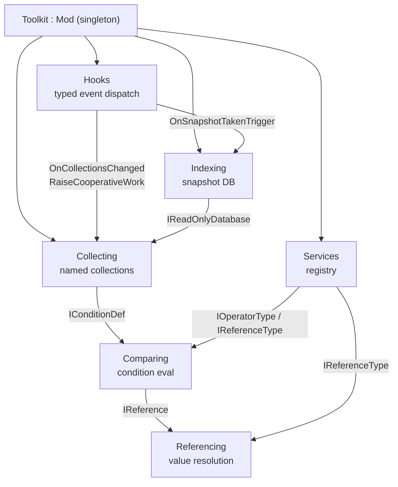

# Homebrewed Toolkit Wiki Quickstart

`HomebrewDot.Net.RimWorld.Toolkit` is a single C# (.NET Framework 4.7.2) **library mod** for RimWorld 1.6. It exposes static APIs through a [`Toolkit : Mod`](architecture/overview.md) facade for typed game-event hooks, snapshot-based background-queryable indexing of game data, declarative condition comparing with expression-tree compilation, named live collecting of matching objects, late-bound referencing, and an in-game debug UI. It is not a content mod — it exists to be referenced by other mods that consume the static APIs.

## High-level map



| Concept | What it does | Wiki page |
|---------|--------------|-----------|
| **Toolkit facade** | The `Mod` singleton, `ConfigureServices` bootstrap, `Services` registry, `Helpers`, `Pool`/`Cache`, `ToolkitSettings` | [Toolkit facade](facades/toolkit.md) |
| **ToolkitConstants** | Tick intervals, mod interop, per-type reflection cache, metadata keys for built-in indexers | [Constants](facades/constants.md) |
| **Hooks** | Typed event dispatch (`IHook<T>`), game/map triggers fired by Harmony patches, cooperative work across ticks | [Hooks](hooks/overview.md) |
| **Indexing** | Snapshot DB, gatherers, indexers, change tracking; immutable snapshots safe for background threads | [Overview](indexing/overview.md), [DB & snapshots](indexing/database-and-snapshots.md), [Gatherers & indexers](indexing/gatherers-and-indexers.md) |
| **Comparing** | Fluent condition DSL, operator types, interpretive + compiled expression-tree evaluation, XML serialization | [Comparing](comparing/overview.md) |
| **Collecting** | Named live collections, `SnapshotCollector`/`MonitorCollector`, sub-collection references | [Collecting](collecting/overview.md) |
| **Referencing** | Late-bound value resolution by named reference type (Value/Self/Property/Indexed/Stat/Comp/Def) | [Referencing](referencing/overview.md) |
| **UI** | Mod settings window, dev-mode debug tabs, condition/collection editors, reusable IMGUI primitives | [UI](ui/overview.md) |
| **Generic/Extensions** | `ICacheable`/`IPoolable`, `NullDictionary`, poolable collections, Enumerable/Object/Type extensions | [Generic](generic/overview.md) |
| **Testing & Build** | Unit/integration/benchmark projects, `Tentity` test model, env-var reference resolution, dev mod-sync | [Testing & Build](testing-and-build/overview.md) |

## Main APIs (from README, verified against source)

### Hooks — run code when game events fire

```csharp
using HomebrewDot.Net.Rimworld;
using HomebrewDot.Net.Rimworld.Hooks.Triggers;

Toolkit.Hooks.Manager.RegisterHook<OnGameLoadedTrigger>(
    Toolkit.Instance,
    e => Toolkit.Indexing.StartIndexing(e.Game, takeSnapshot: true));
```

See [Hooks](hooks/overview.md) for the trigger types, priority ordering, `Once` semantics, and `TriggerDelayed`/cooperative work.

### Indexing — build read-only snapshots queryable outside the main loop

```csharp
using HomebrewDot.Net.Rimworld;
using HomebrewDot.Net.Rimworld.Indexing.Components;
using Verse;

Toolkit.Indexing.ConfigureOrchestrator += x => x.With(DefGatherer.Instance);
Toolkit.Indexing.StartIndexing(Current.Game, takeSnapshot: true);

var snapshot = Toolkit.Indexing.Manager.DatabaseSnapshot;
```

Advanced — configure schema with sub-tables:

```csharp
Toolkit.Indexing.ConfigureSchema(builder =>
    builder.WithTable<Def>(nameof(Def),
        table => table.WithSubTable<ThingDef>(nameof(ThingDef))));
Toolkit.Indexing.ReloadOrchestration();

var thingTable = Toolkit.Indexing.Manager.DatabaseSnapshot?.GetTable<ThingDef>($"{nameof(Def)}.{nameof(ThingDef)}");
```

See [Indexing overview](indexing/overview.md) and [Database & snapshots](indexing/database-and-snapshots.md).

### Collecting — define named filters and keep collector sets in sync

```csharp
using HomebrewDot.Net.Rimworld;
using HomebrewDot.Net.Rimworld.Indexing;
using RimWorld;
using Verse;

var table = $"{nameof(Def)}.{nameof(ThingDef)}.Weapon.Ranged";
var getThings = new Func<IReadOnlyDatabase, IEnumerable<IIndexed<ThingDef>>>(s => s.GetTable<ThingDef>(table));

Toolkit.Collecting.Build("Snipers", b => b
    .Compare.Indexed(ToolkitConstants.Stats.Weapon.Def.Range).With.GreaterThanOrEqual().To.Value(30)
    .CollectFromSnapshot(getThings));

Toolkit.Collecting.StartCollection();

var collectors = Toolkit.Collecting.GetAllCollectors();
if (collectors.TryGetValue("Snipers", out var collector))
    foreach (IIndexed<ThingDef> item in collector.GetAll())
        Log.Message(item.Value.defName);
```

See [Collecting](collecting/overview.md) for `SnapshotCollector` vs `MonitorCollector`, sub-collection references, and the `OnCollectionsChanged` trigger.

### Services — register and resolve shared objects by type or name

```csharp
Toolkit.Services.Register<IMyService>(new MyService());
var service = Toolkit.Services.GetRequired<IMyService>();
Toolkit.Services.Unregister<IMyService>(service);

// Named + case-insensitive
Toolkit.Services.Register<IMyService>(new MyService("ui"), "ui");
var uiService = Toolkit.Services.Get<IMyService>("ui");
var allNamed = Toolkit.Services.GetAllNamed<IMyService>();
Toolkit.Services.UnregisterByName<IMyService>("ui");
```

See [Toolkit facade](facades/toolkit.md) for the registry invariants (LIFO unnamed, case-insensitive names, `NullDictionary` empty fallback).

## Task-routing table

| Change area / intent | Wiki page | Owning source / symbols | Focused tests | Validation |
|----------------------|-----------|-------------------------|--------------|------------|
| Add a new game-event hook | [Hooks](hooks/overview.md) | `Toolkit.Hooks.Manager.RegisterHook<T>`, `SimpleHook<T>`, `GameTriggers.Patches`, `MapTriggers` | `HookManagerTests`, `SimpleHookTests`, `HooksIntegrationTests` | `dotnet test --filter "FullyQualifiedName~Hooks"` |
| Add a new trigger type | [Hooks](hooks/overview.md) | `Hooks/Triggers/GameTriggers.cs` (add POCO + Harmony patch) | `HooksIntegrationTests` | as above |
| Add a gatherer for new game data | [Indexing gatherers](indexing/gatherers-and-indexers.md) | `IDataGatherer` impl, `Toolkit.Indexing.ConfigureOrchestrator += b => b.With(g)` | `HarmonyThingGathererTests`, `SnapshotOrchestratorTests` | `dotnet test --filter "FullyQualifiedName~Indexing.Components"` |
| Add a built-in indexer (enrich metadata) | [Indexing overview](indexing/overview.md) | `Toolkit.Indexing.Indexers.BuildIndexer<T>`, `TrackedIndexer<T>`, `IIndexerBuilder<T>` (`When`/`Set`/`Requires`/`Include`), metadata key in `ToolkitConstants` | `TrackedIndexerTests`, `TrackedIndexerUpsertFlowTests`, `IndexerIntegrationTests` | `dotnet test --filter "FullyQualifiedName~TrackedIndexer"` |
| Add a change tracker | [Indexing gatherers](indexing/gatherers-and-indexers.md) | `IChangeTracker<T>`/`PropertyChangeTracker<T,TProperty>`, `Toolkit.Indexing.Indexers.ByProperty`/`ByPath` | `PropertyChangeTrackerTests` | as above |
| Define a new database table/sub-table | [Indexing DB](indexing/database-and-snapshots.md) | `ConfigureSchema += b => b.WithTable<T>(...)`, `WithSubTable`, `WithIndex`, `WithListener` | `DatabaseTests`, `IndexingConfigurationIntegrationTests` | `dotnet test --filter "FullyQualifiedName~DatabaseTests"` |
| Add an operator type | [Comparing](comparing/overview.md) | `IOperatorType`/`IOperatorTypeCompileable`, register in `Toolkit.ConfigureServices` (aliases), `BaseComparableOperatorType`/`BaseNativeOperatorType` | `OperatorTypesTests`, `EnumComparisonOperatorTests` | `dotnet test --filter "FullyQualifiedName~Comparing"` |
| Add a reference type | [Referencing](referencing/overview.md) | `IReferenceType`/`IReferenceTypeCompileable`, register in `Toolkit.ConfigureServices`, fluent extension | `ReferenceTypeTests`, `PropertyReferenceTypeTests`, `ReferenceResolverTests` | `dotnet test --filter "FullyQualifiedName~Referencing"` |
| Add a named collection | [Collecting](collecting/overview.md) | `Toolkit.Collecting.Build`, `ICollectionBuilder` (`Compare`/`With`/`To`/`CollectFromSnapshot`/`IncludeFrom`) | `CollectionBuilderTests`, `CollectionIntegrationTests` | `dotnet test --filter "FullyQualifiedName~Collecting"` |
| Add a snapshot-driven collector variant | [Collecting](collecting/overview.md) | `SnapshotCollector<T>` (`IHook<OnSnapshotTakenTrigger>`), `CollectFromSnapshot` | `SnapshotCollectorTests` | as above |
| Add a sub-collection (monitor) | [Collecting](collecting/overview.md) | `MonitorCollector<T>` (`IHook<OnCollectionsChanged>`), `CollectFromCollection` | `MonitorCollectorTests` | as above |
| Add/modify a mod setting | [Toolkit facade](facades/toolkit.md), [UI](ui/overview.md) | `ToolkitSettings` field + `ExposeData`, `SettingsUiTab` checkbox, `ToolkitSettings.Changed` subscribers | (settings fire on save) | `dotnet test --filter "FullyQualifiedName~ToolkitServices"` |
| Add an editor window / input helper | [UI](ui/overview.md) | `ConditionDefEditorWindow`, `CollectionDefConfigEditorWindow`, `IReferenceTypeInputHelper`, register in `ConfigureServices` | `ConditionDefEditorWindowTests`, `CompReferenceTypeInputHelperTests` | `dotnet test --filter "FullyQualifiedName~UI"` |
| Add a poolable / cacheable type | [Generic](generic/overview.md) | `IPoolable`/`ICacheable`, `PooledHashSet<T>`/`PooledList<T>`, `Toolkit.Pool<T>`/`Cache<TKey,TValue>` | `NullDictionaryTests`, `EnumerableExtensionsTests` | `dotnet test --filter "FullyQualifiedName~Collections.Models"` |
| Add a reflection helper | [Toolkit facade](facades/toolkit.md) | `Helpers.Expression`, `Helpers.Traversing`, `ToolkitConstants.ObjectCache<T>`, `ToolkitConstants.Reflections` | `ExpressionTests`, `TraversingTests`, `TypeUnitTests` | `dotnet test --filter "FullyQualifiedName~Helpers"` |
| Change build output / dev sync | [Testing & Build](testing-and-build/overview.md) | `HomebrewDot.Net.Rimworld.Toolkit.csproj` (env vars, `OutputPath`, `SyncModContentToModsFolderForTesting`), `About/About.xml` | — | `dotnet build src/.../csproj -c Release` |

## Build & test quick reference

```bash
# Build product (outputs 1.6/Assemblies/HomebrewDot.Net.Rimworld.Toolkit.dll)
dotnet build src/HomebrewDot.Net.RimWorld.Toolkit/HomebrewDot.Net.Rimworld.Toolkit.csproj -c Release

# Run unit tests
dotnet test tests/Unit/HomebrewDot.Net.RimWorld.Toolkit/HomebrewDot.Net.RimWorld.Toolkit.Tests.csproj

# Run integration tests (requires RimWorld at RIMWORLD_ROOT)
dotnet test tests/Integration/HomebrewDot.Net.RimWorld.Toolkit/HomebrewDot.Net.RimWorld.Toolkit.IntegrationTests.csproj

# Focused filter by namespace/class
dotnet test tests/Unit/.../Tests.csproj --filter "FullyQualifiedName~Indexing.Components.DatabaseTests"

# Benchmarks
dotnet run -c Release --project bench/HomebrewDot.Net.RimWorld.Toolkit
```

The product and test projects resolve RimWorld (`Assembly-CSharp.dll`, `UnityEngine.*`) and Harmony (`0Harmony.dll`) via environment variables (`RIMWORLD_ROOT`, `RIMWORLD_MANAGED`, `RIMWORLD_HARMONY_ROOT`, `RIMWORLD_VERSION`, `HARMONY_VERSION`). See [Testing & Build](testing-and-build/overview.md).

## Backlog (deferrals)

No subsystem is deferred — all manifest-backed components are documented. The `Patches/` source directory is intentionally empty (Harmony patches are applied programmatically inside `GameTriggers.Patches` and `HarmonyThingGatherer`, documented under [Hooks](hooks/overview.md) and [Indexing gatherers](indexing/gatherers-and-indexers.md)).
